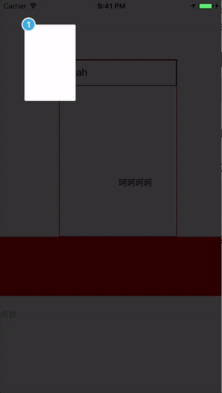
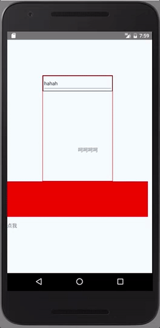

# react-native-intro
A way for new  feature introduction and step-by-step users guide for your react-native app

# Install
Run ```npm install react-native-intro --save``` in your Project dir

# Usage

1. react-native-intro exports two APIs, default is ```Intro``` component, and the other one is ```intro``` function. see [demo](./demo/) get more informations.

2. Use ```Intro``` component wrap your components and pass some props to Intro. Maybe you need set the style props too;

```
import Intro, { intro } from 'react-native-intro';

<Intro
    content={"hello world"}
    step={1}>
</Intro>

.....

componentDidMount() {

    // and start
    var myIntro = intro({group: 'yourGroup'});
    myIntro.start();

}

```

#Props
###content: string | ReactElement

###step: the step sort



